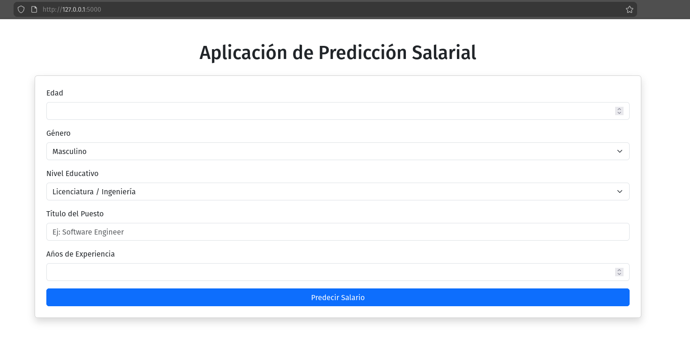

# 💰 Predicción de Salarios con Machine Learning

Este proyecto es una aplicación web desarrollada con **Flask** que utiliza un modelo de Machine Learning para predecir el salario estimado de un empleado basándose en sus características demográficas y profesionales.

## 📋 Descripción del Proyecto
La aplicación toma datos de entrada del usuario (Edad, Género, Nivel Educativo, Puesto de Trabajo y Años de Experiencia) y utiliza un modelo de **Regresión Lineal** entrenado para calcular una predicción salarial.

El objetivo es demostrar el flujo completo de un proyecto de Ciencia de Datos: desde la limpieza de datos y entrenamiento del modelo, hasta su despliegue en una interfaz web amigable.

## 🛠️ Tecnologías Utilizadas
* **Lenguaje:** Python 3
* **Web Framework:** Flask
* **Data Science:** Pandas, NumPy
* **Machine Learning:** Scikit-Learn (Pipeline, OneHotEncoder, StandardScaler)
* **Persistencia del Modelo:** Joblib
* **Frontend:** HTML5, CSS3, Bootstrap 5

## 📊 Dataset y Modelo
* **Fuente de Datos:** `salarydataset.csv`
* **Algoritmo:** Regresión Lineal (Linear Regression).
* **Métricas de Evaluación:**
    * R2 Score: ~0.87 (El modelo explica el 87% de la variabilidad).
* **Formato de Guardado:** El modelo entrenado se exporta como `model/salary_model.joblib`.

## 📸 Captura de Pantalla
Aquí se muestra la aplicación en funcionamiento con una predicción realizada:
  



## 🚀 Instalación y Ejecución

Sigue estos pasos para correr el proyecto en tu máquina local:

1. **Clonar el repositorio:**
   ```bash
   git clone [https://github.com/Stevie069/salario-predicci-n.git](https://github.com/Stevie069/salario-predicci-n.git)
   cd salario-predicci-n

